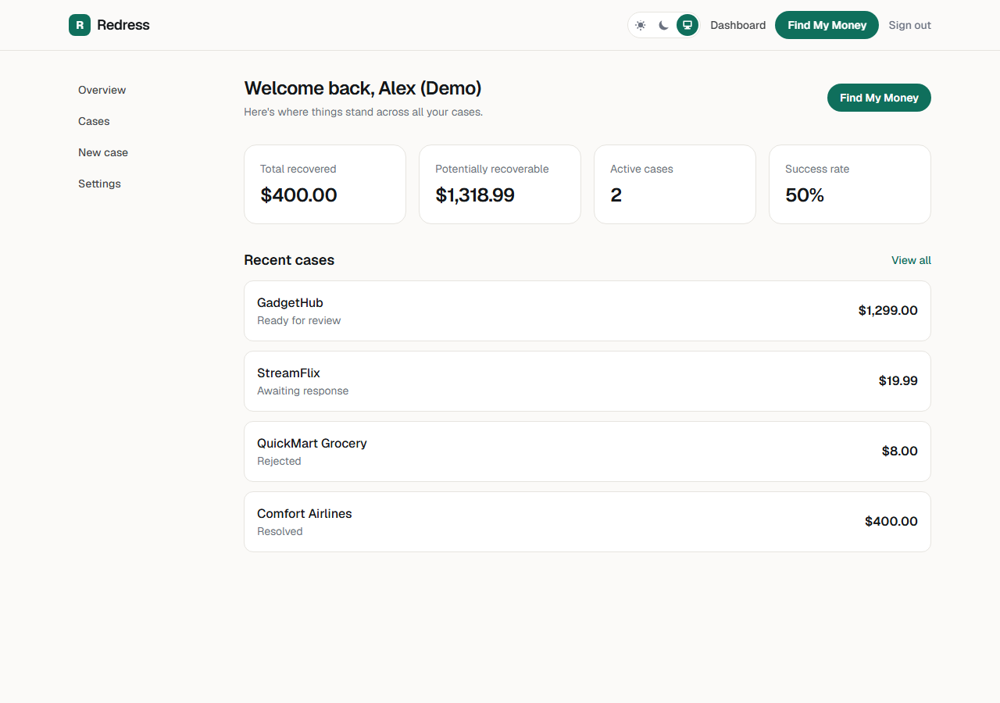
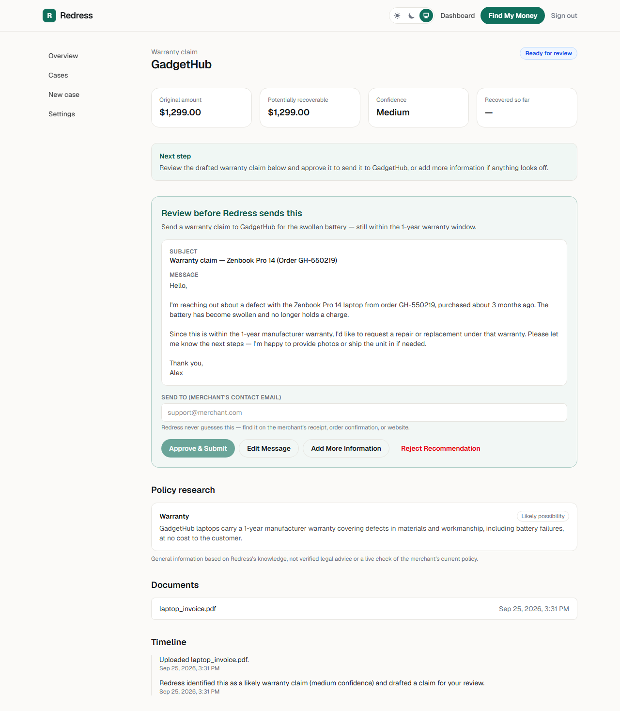
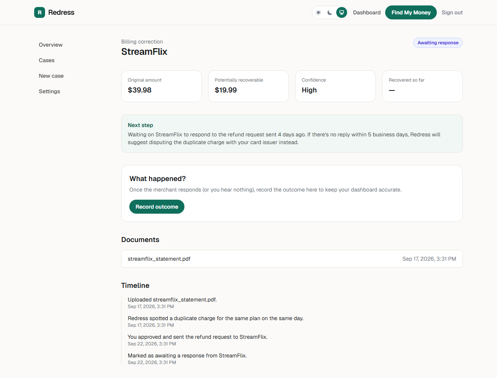
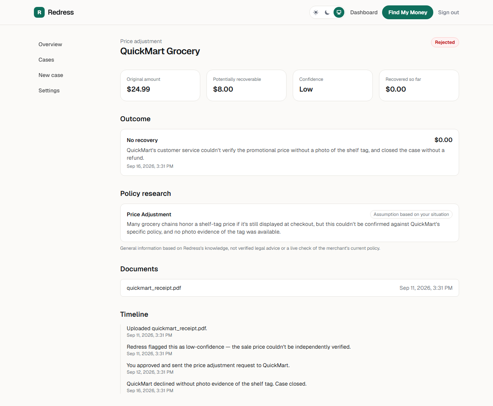

# Redress

An AI-assisted workflow for turning a receipt, bill or customer-service problem into a drafted claim message, where **nothing is sent unless the user explicitly approves it**, and that rule is enforced by the API, not by the prompt.

**Live demo:** https://redress-weld.vercel.app: sign in with `demo@redress.app` / `RedressDemo2026!` (a shared public demo account with sample cases; it cannot be deleted or have its password changed)

> Portfolio project. No real users. AI features use Google Gemini; without an API key the app runs in a clearly labelled demo mode.

## Screenshots

| | |
| --- | --- |
|  |  |
| **Dashboard**: recovered, recoverable, active cases | **Approval gate**: the user reviews the draft and types the recipient; nothing is sent until they approve |
|  |  |
| **Tracking**: after approval, the case waits for the merchant and the outcome is recorded | **Honest outcomes**: a low-confidence claim flagged as an assumption, and a rejection recorded as no recovery |

Screenshots come from a local run of the seeded demo data (the same seed as the live demo). No real documents or people.

## Overview
A user uploads a document and describes the problem. A four-stage pipeline extracts the facts, identifies what they might be entitled to, researches the merchant's likely policy, and drafts a message. The user reviews and edits the draft, enters the merchant's email address, and approves. Only then does the system send it, and it tracks the outcome.

## Why I Built It
Most AI demos end at "upload a file, get a summary." I wanted to work on the harder part: letting a model contribute to a real-world action (an email to a third party) while guaranteeing it can't act without the user's consent, and being honest about what the model does and doesn't know.

## Key Features
- Document upload (PDF/PNG/JPEG/WebP) with **byte-level file-type verification**. Uploads are recorded as `validated` (size, type and signature checked); there is **no malware scanning**, and the app never labels a file "clean" or "scanned".
- **Four-stage AI pipeline:** document analysis → opportunity detection → policy research → claim drafting. Each stage's input and output is stored for traceability.
- **Confidence labels:** extracted fields carry confidence/uncertain flags; research findings carry a certainty level (`confirmed_policy`, `likely_possibility`, `user_specific_assumption`, `unknown`), shown in the UI.
- **Human approval:** edit the draft, supply the recipient address yourself, approve or edit. Failed sends leave the approval pending with the error shown.
- **Re-analysis:** add more information and the pipeline re-runs; any older pending approval is superseded so a stale draft can't be sent.
- Outcome tracking (resolved/rejected, recovered amount), dashboard stats, case timeline.
- Accounts: register, sign in, password reset by email, email verification (**required before a real email is sent**, see below), account deletion, audit log.

## Architecture
```
Browser ─► Next.js 16 (App Router pages + API routes)
              │
              ├─ Auth.js (credentials, bcrypt, JWT sessions)
              ├─ Prisma 7 ─► Postgres (Neon)   [cases, documents, AIAnalysis, Communication,
              │                                  UserApproval, Job, AuditLog, …]
              ├─ Upload ─► Vercel Blob (local disk in dev)
              ├─ Job row created ─► pipeline runs INLINE in the same request (not a background
              │                     worker), scoped to that case; failures are recorded, not retried
              │       └─ Gemini (JSON-schema output) ─► Zod validation ─► safety layer
              ├─ Draft saved as Communication(status = "draft") + UserApproval(pending)
              └─ POST /approve  ─► checks session, ownership, rate limit, placeholders,
                                    user-typed recipient ─► Resend ─► status "sent"
```

## Technical Highlights
- **Approval gate in the data layer:** a `Communication` only moves from `draft` to `sent` in `approve/route.ts`, which requires a pending `UserApproval`, a session that owns the case, and a recipient typed by the user. The pipeline itself can never create a sent message.
- **Prompt-injection awareness:** uploaded documents are treated as untrusted data in every agent prompt, and because the gate doesn't depend on model behaviour, a hostile document still can't trigger a send.
- **Structured, validated model output:** Gemini is called with a JSON schema, then parsed with Zod; invalid output fails loudly.
- **Draft safety screen:** deterministic checks flag threats, legal claims and "guarantee" language, and unfilled `[INSERT …]` placeholders block approval. (A guardrail, not a filter: rule-based and bypassable.)
- **Ownership on every route:** cases, documents, approvals and notes are looked up and checked against the signed-in user (a uniform 404 for someone else's record); regression tests cover each route. Document downloads are served with `nosniff` and a sandboxing CSP, and internal storage keys are never returned by the API.
- **Verified email before real sends:** when a real email provider is configured, the approval route refuses to send from an unverified account, because the message carries the user's address as Reply-To.
- **Daily AI budget:** each account can start a limited number of analyses per rolling 24 hours (default 20, `AI_MAX_ANALYSES_PER_DAY`), so a free account can't run up unlimited model calls. This bounds one account, not many: a global spend cap at the AI provider is still advisable.
- **Baseline security headers** on every route, including `X-Frame-Options: DENY` so the approve/send buttons can't be clickjacked.
- **Emailed links** (password reset, verification) use a configured base URL (`APP_URL` / Vercel production URL), never the request's Host header.
- **Rate limiting** (Upstash Redis with an in-memory fallback for local dev) on sign-in (per IP, and per account), registration, password reset, case creation, approval, notes and outcome routes.
- **Shared demo account protected:** deletion and password reset are refused for it, since its credentials are public, and it can never send real email: approving a claim on it is always simulated and labelled as such, even if an email provider is configured.
- **Upload validation** by magic bytes, not client MIME type.
- **Auditability:** every agent call is stored; security-relevant actions write an audit log.
- Demo seed script writes straight to the database so the demo needs no live AI calls.

## Testing
`npm test`: **105 Vitest tests in 11 files**. Last run: 105 passed. They cover billing config, file-signature sniffing, rate limiting, the safety layer and validation schemas, plus route-level tests of the **approval gate** (unauthenticated, rate-limited, someone else's case, nothing pending, missing recipient, unfilled placeholder, successful send to the user-typed address, provider failure keeps the approval pending, edit and reject never send), demo-account protection, and the job worker's claim/failure handling. `npm run lint` and `tsc --noEmit` are clean, and GitHub Actions runs lint, type-check, tests and a Gitleaks secret scan.
Also covered: ownership (IDOR) checks on the document, case, notes and outcome routes, the upload's honest `validated` status and its failure handling (the file is stored first, the case+document+event are one atomic write, a failed write deletes the stored file, a failed job enqueue leaves a recoverable case), storage-path containment, the emailed-link base URL, and job scoping (a request only runs its own case's job). Black-box check: I also ran a production build against a real Postgres with two real users and confirmed over HTTP that a second signed-in user gets 404 on another user's case, document, notes, outcome and approval endpoints (identical to a made-up id), that the owner gets 200, that documents are served with `nosniff` and a sandboxing CSP, and that the case API returns no storage keys. That check also found that only Neon databases worked (now fixed). Not covered: the AI pipeline itself (no live model calls in tests), authentication end to end, and the UI. Database, session, email and rate-limit dependencies are mocked in the route tests.

## Tech Stack
Next.js 16, React 19, TypeScript, Tailwind CSS 4, Prisma 7 + PostgreSQL (Neon), Auth.js (NextAuth v5), bcryptjs, Zod, Google Gemini (`@google/genai`), Resend, Vercel Blob, Upstash Redis rate limiting, Vitest, ESLint, GitHub Actions, Vercel.

## Demo
Live: https://redress-weld.vercel.app: shared demo account `demo@redress.app` / `RedressDemo2026!`. Re-run `npx tsx scripts/seed-demo.ts` to reset its data. Four seeded cases show each stage of the lifecycle, including one claim the AI honestly couldn't support.
Run locally: copy `.env.example` to `.env`, set `DATABASE_URL` (any Postgres: Neon / Vercel Postgres hosts (`*.neon.tech`) use the Neon serverless driver, everything else, e.g. local or Docker, uses the standard `pg` driver; override with `DATABASE_DRIVER=neon|pg`) and `AUTH_SECRET`, then:
```bash
npm install
npx prisma migrate dev
npm run dev
npm test
```
Set `GEMINI_API_KEY` for real analysis (otherwise demo mode) and `RESEND_API_KEY` for real email (otherwise sends are simulated and labelled).

## Current Status
Working personal portfolio project. Known limitations, stated plainly:
- The analysis job runs **inline in the request** (claimed atomically); failed jobs are marked failed and are **not retried automatically**. The user can re-run analysis by adding more information.
- **No malware scanning** exists. Uploads are validated (size, type, magic bytes) and stored privately, but never scanned; the `securityStatus` field says `validated`, and `scanned_clean` is reserved for a future real scanner. Billing is configuration only (no payment processing). The Vercel request-body limit (about 4.5 MB) is lower than the app's 15 MB cap, so larger uploads fail on Vercel.
- `npm audit` reports 4 high findings, all inside the Prisma CLI toolchain (npm's suggested fix is downgrading Prisma to 6); none is in request-handling code. Next.js is on a patched release.
- Gemini only. Not evaluated for accuracy on real-world documents.

## Future Development
Provider abstraction (add Claude/OpenAI), a real queue with retry/backoff, tests for the AI pipeline, scheduled demo-data reset, antivirus scanning, and an accuracy evaluation set.
